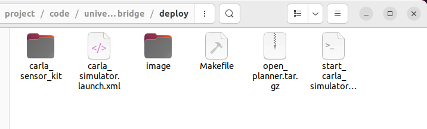
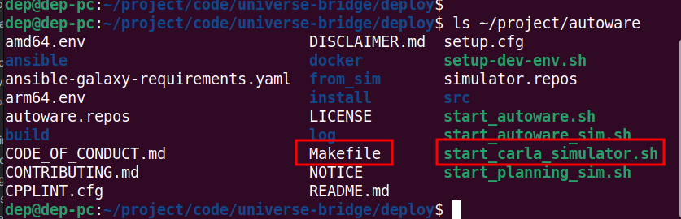
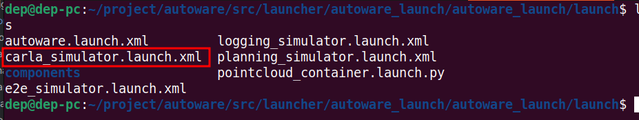
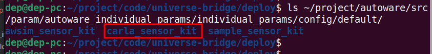
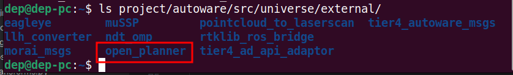
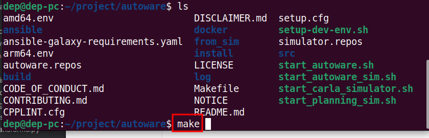
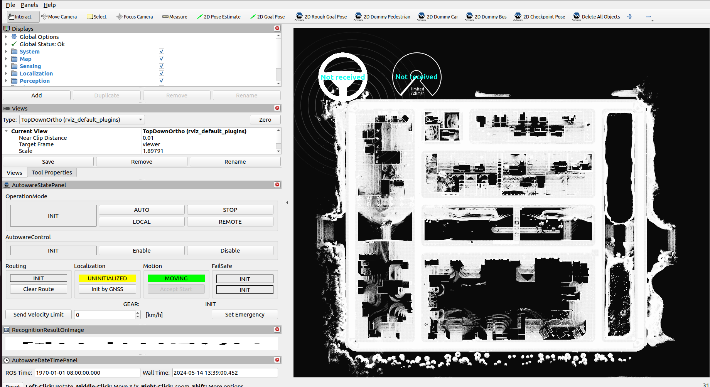
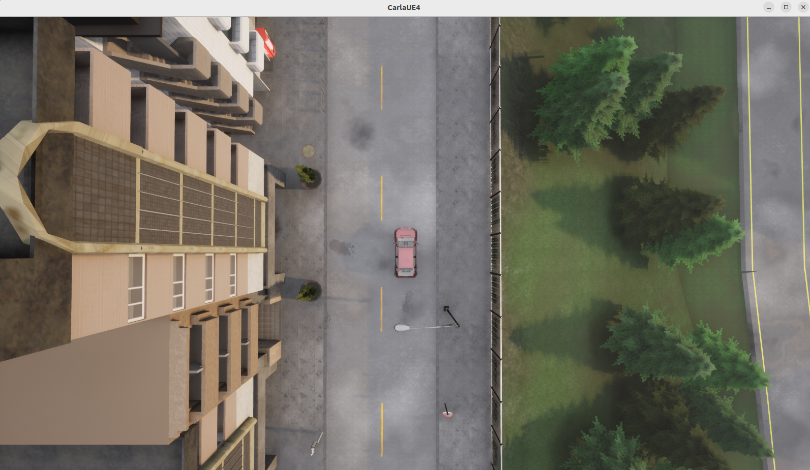
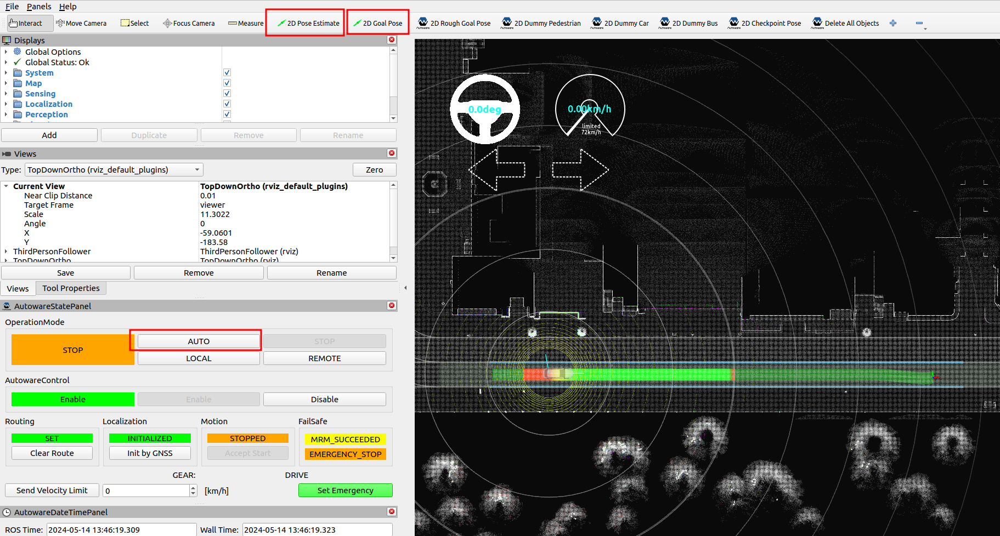
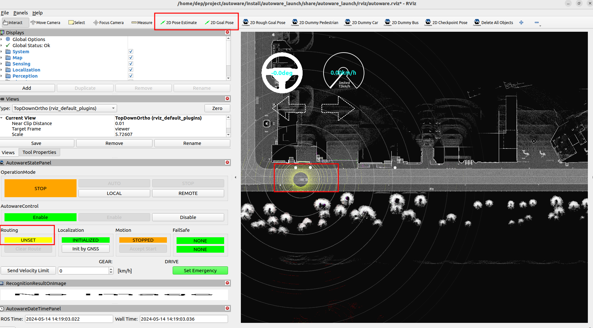

<a name="readme-top"></a>


<!-- PROJECT LOGO -->
<br />
<div align="center">

  <h1 align="center">Carla Autoware Bridge</h1>
  <p align="center">
    <b>Carla & Autoware.Universe Co-simulation</b>
    <!-- <br /> -->
    <!-- <a href="https://github.com/othneildrew/Best-README-Template"><strong>Explore the docs »</strong></a>
    <br /> -->
    <br />
    <a href="https://github.com/guardstrikelab/carla_universe_bridge/issues">Report Bug</a>
    ·
    <a href="https://github.com/guardstrikelab/carla_universe_bridge/pulls">Request Feature</a>
    <br>
  </p>
</div>


[](https://www.tickgit.com/browse?repo=github.com/guardstrikelab/carla_universe_bridge)


[](https://github.com/guardstrikelab/carla_universe_bridge/blob/master/LICENSE)


<!-- ABOUT THE PROJECT -->
## About
This project aims to provide a data and control bridge for the communication between Carla and Autoware.Universe. 

## 1. Preset condition

+ Ubuntu 22.04

+ Python 3.10

+ ROS2 Humble

+ Install universe

    Refer to the official link to install universe. [source-installation](https://autowarefoundation.github.io/autoware-documentation/latest/installation/autoware/source-installation/)
    
    Note: that we are using the `release/2023.10`  branch, the rest of the branches are unverified.

+ Install Carla 0.9.15

    Refer to the official link to install Carla. [carla-installation](https://carla.readthedocs.io/en/latest/start_quickstart/#carla-installation)
    

## 2. Install carla_universe_bridge


- Download the code

```shell
git clone https://github.com/guardstrikelab/carla_universe_bridge.git
```

- Install the dependencies

```shell
pip install -r ./carla_universe_bridge/requirements.txt
```

Add `PYTHONPATH` to `~/.bashrc` and replace it with your local path.

```shell
export PYTHONPATH=$PYTHONPATH:$(pwd)/carla_universe_bridge/src/PythonAPI/carla-0.9.15-py3.10-linux-x86_64.egg:$(pwd)/carla_universe_bridge
```

Verify that the `carla` package is available.

```shell
source ~/.bashrc

python -c "import carla;client=carla.Client('localhost', 2000);word= client.get_world();print('OK')"

```

Output `OK`, indicating that carla is OK.

- Install of plug-ins

Go to the `deploy` directory as follows.



1. Copy the `Makefile`, `start_carla_simulator.sh` to the `autoware` directory. 

```shell
cp Makefile start_carla_simulator.sh   ~/project/autoware
```

Note: The map_path:=/home/dep/project/code/carla_universe_bridge/map/Town01 in this script needs to be changed to your actual map storage path.




Copy the `carla_simulator.launch.xml` to the `autoware/src/launcher/autoware_launch/autoware_launch/launch` directory.

```shell
cp carla_simulator.launch.xml   ~/project/autoware/src/launcher/autoware_launch/autoware_launch/launch
```




2. Copy the `carla_sensor_kit` folder to the `autoware/src/param/autoware_individual_params/individual_params/config/default/` directory.

```shell
cp -r carla_sensor_kit/   ~/project/autoware/src/param/autoware_individual_params/individual_params/config/default/
```



3. Extract `open_planner.tar.gz` to the `autoware/src/universe/external/` directory.



4. Finally, run the `make` command to recompile `universe`.



Add the following command to ~/.bashrc and replace it with your local path.
```shell
source /opt/ros/humble/setup.bash
source xxxx/autoware/install/setup.bash
```

then run
```shell
source ~/.bashrc
```

5. Configure carla_universe_bridge

Go to the `carla_universe_bridge` directory, open `config/config.yaml` and change the relevant fields.

```yaml
oasis:
  host: 'localhost'    # IP address of the carla server
  carla_port: 2000
  carla_timeout: 30
```

## 3. Run carla_universe_bridge
1. Go to the `autoware` directory and execute the command.

```shell
./start_carla_simulator.sh
```
Wait for the startup to finish loading the map as follows.



2. Start carla

```shell
./CarlaUE4.sh
```

3. Go to the `carla_universe_bridge` directory and execute the command.
```shell
python spawn_ego/spawn_ego_vehicle.py
```
Wait for command line output `Done`. 
The ego vehicle will be spawned in the carla simulator as follows.


4. Open a new command line terminal and run `main.py` in the `carla_universe_bridge` directory.

```shell
python main.py
```

In the rviz of the universe you will see the generated ego vehicle and the planned paths as follows.



5. Click on the `AUTO` button and the main vehicle will follow the planned trajectory.

## 4. TODO

- [ ] On line 131 of the `spawn_ego_vehicle.py` script, the ego vehicle location needs to be made into a configuration item.
```python
spawn_point = carla.Transform(carla.Location(x=119.267, y=330.394, z=0), carla.Rotation(yaw=0, pitch=0, roll=0))
```
- [ ] In lines 42 and 43 of the `main.py` script, sending the start and end positions of the ego vehicle needs to be a configurable item.
```python
self.init_position = {'x': '119.267', 'y': '330.394', 'z': '0', 'r': '0', 'p': '0',  'h': '0'}
self.dst_position = {'x': '307.291', 'y': '330.394', 'z': '0', 'r': '0', 'p': '0',  'h': '0'}
```
- [ ] When both universe and bridge are started for the first time, you may encounter the problem of the ego vehicle position deviation or no planned trajectory, see the figure below, in this case, you need to re-specify the start point and the end point by using the 2D Pose Estimate and 2D Goal Pose buttons in rviz.



- [ ] The rviz interface API has been implemented in `engage_node.py`, but it is not yet automated and needs to be optimized.


- [ ] `main.py` and `spawn_ego_vehicle.py` do not support continuous running yet and need to be optimized.


- [ ] The conversion method between carla xodr and universe osm format maps needs further research.


## 5. Reference
+ [op_carla_bridge](https://github.com/ZATiTech/open_planner/tree/humble/op_carla_bridge)
